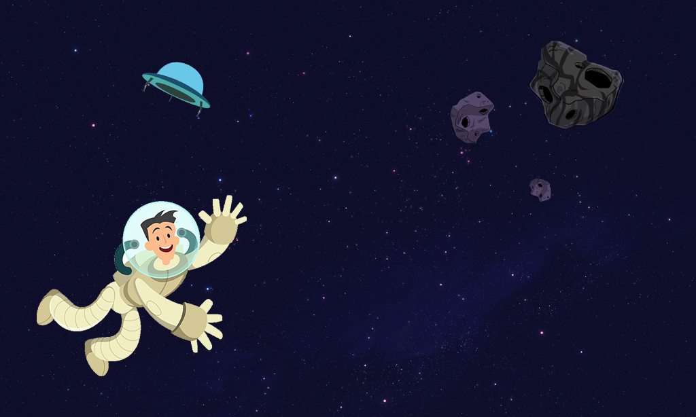
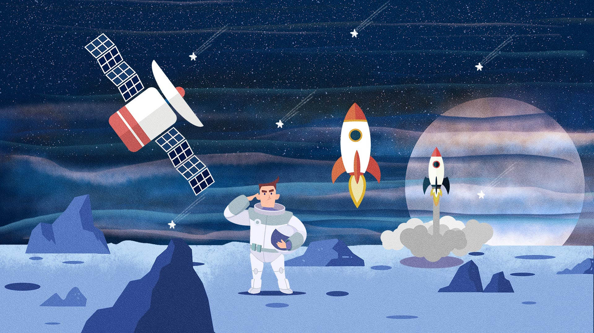

## 背景故事

（版1：时针轻轻从“9”处摆过，发出一声细微的声响。马大叔终于完成了手中的工作。

他伸了个懒腰，马马虎虎将工位上的杂物收好，电脑关闭，疲惫地走出了公司大门。

这是一座名为芜湖的城市，他在这家公司已经工作了十余年，在一天天的繁重任务中，名为青春之物已逐渐从他手中溜走，纷杂的日常如同无尽的黄沙，掩盖住了他年少时的理想。

然而今夜大街上甚是安静，或许是凛冽的寒风侵扰，人们都躲在家中。他走出大门，抬头望了眼夜空，繁星闪烁，如同那无尽的秘宝，纷纷绽放出属于自己的光芒，精彩夺目。他苦涩地笑了笑，自己儿时的理想曾孕育在这满天的繁星中，却又被现实无情地击垮。

“妈妈，我也要当太空人“，他冲着这广阔的天空大喊，如同笼中之鸟的高歌。

突然，一阵金光闪过，没等他反应过来，自己已身处这光芒之下。在那本来空无一物的天空中，逐渐浮现出一个黑色的飞碟，一个男孩子从中探出头来，冲他微笑。

时至今日，马大叔还记得孩子当时的那句话，”只要你想，星空，就在你脚下，怎么样，要和我一起去星海中航行吗？“

那一瞬间，紧闭的牢笼被拉开了，阳光撒进了无边的黑夜，他在这光芒中颤抖着说出了自己的答案

“我——愿意”）

版2：

马大叔是一名大龄程序员，虽然生活有着诸多不顺，可是他却始终却没有放弃自己小时候的梦想——在星海中漫步。今夜，他终于得到了幸运女神的垂青。在下班回家的路上，马大叔遇到了神秘的飞船和男孩，一场奇妙的太空探险就此展开——

背景图——

文字上

文字下——

## 关卡选择（故事用于关卡详情页面，图用于关卡选择页面）

**第一关**

关卡信息——北极，神秘人的基地

马大叔已经全副武装，在飞来此处的路上，男孩已经把事情的经过告诉了他。男孩名为陆飞，他们家族拥有着世界上最大的飞行物设计公司。此次出发，正是为了寻找祖上流传下来的传说——名为”one piece"的宇宙大秘宝。他希望马大叔能和他一起，向着无垠的宇宙进发。

“准备开始，起飞！”，随着机械女声响起，飞碟的发动机开始轰鸣

让我们一鼓作气，冲破大气层吧

提示信息——学习使用和运行编程语言

关卡选择——第一关——题图——

**第二关**

关卡信息——在马大叔和陆飞的操作下，飞船终于冲出了大气层，可问题还没有结束。一块卫星残骸正位于他们面前的轨道上，请你操纵人物，避开障碍，继续探险吧！

提示信息——了解顺序结构

关卡选择——第二关——题图

**第三关**

关卡信息——马大叔和陆飞来到了美丽的太阳系，远处是广阔而深邃的宇宙，身后是蔚蓝的地球。曾经的梦想如今化为现实，年少的轻狂最后成为了眼前实景，请你操纵人物，在这美丽的星海中漫游吧

提示信息——需要完成转两个弯的行动

关卡选择——第三关——题图

**第四关**

关卡信息——根据宇宙地图的指示，他们要寻找的秘宝，正位于一个名叫拉夫德鲁的星系中。为了完成友人陆飞的梦想，让我们继续前进吧，笔直地冲出太阳系。

不要停下来啊！

提示信息——调整goStraight的参数来完成目标

关卡选择——第四关——题图

**第五关**

关卡信息——经历了漫长的航行，如今大秘宝已近在眼前。克制住自己的冲动，谨慎地避开每一个障碍，到达那路途的尽头，，梦想之地吧！

提示信息——收集最后的宝藏吧

关卡选择——第五关——题图

## 主页图

版1

t-1234一套

版2

top-1234一套

## 地图人物快

选择地图块2，人物块3种